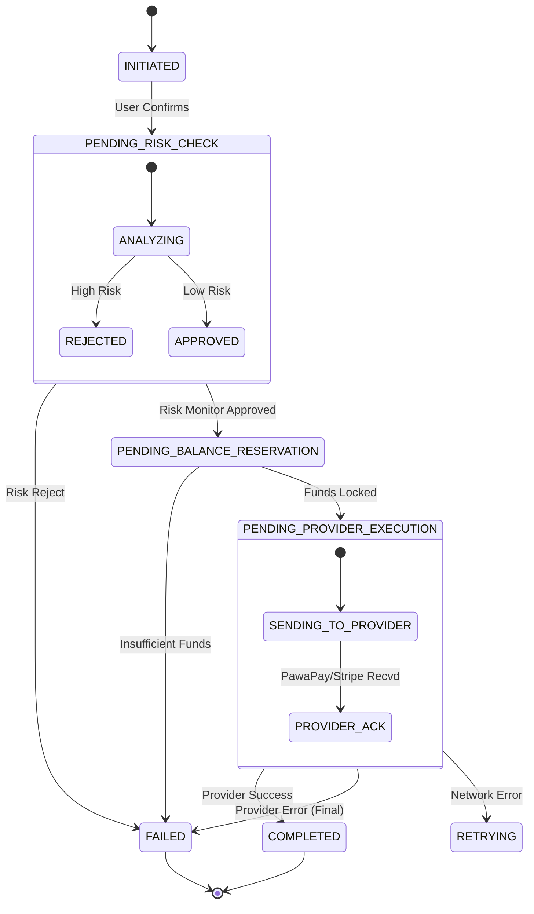

# FlapaPay System Architecture

## 1. System Context Diagram
High-level view of the FlapaPay ecosystem.
```mermaid
graph TD
    User[User (Mobile/Web)] -->|HTTPS/JSON| Frontend[Web App (React)]
    Frontend -->|REST/GraphQL| Gateway[API Gateway]
    
    subgraph "FlapaPay Cloud (Kubernetes)"
        Gateway --> Identity[Identity Service]
        Gateway --> Wallet[Wallet & Ledger Service]
        Gateway --> Payment[Payment Orchestration]
        Gateway --> FX[FX Service]
        
        Wallet --> DB[(PostgreSQL Ledger)]
        Payment --> DB
        Identity --> DB
        
        Payment -.->|Async Events| Wallet
        FX -.->|Rates| Payment
    end
    
    Payment -->|API| PawaPay[PawaPay (Mobile Money)]
    Payment -->|API| Stripe[Stripe (Cards)]
    Payment -->|API| Banks[Bank APIs]
```

## 2. Microservices Responsibilities

| Service | Responsibility | Key Technologies |
|---------|----------------|------------------|
| **Identity** | Auth, Session, KYC | Node.js, JWT, Redis |
| **Wallet** | Ledger, Balance, Accounting | Node.js, PostgreSQL (PL/SQL) |
| **Payment** | Routing, Retries, Provider Integration | Node.js, BullMQ (Queues) |
| **FX** | Real-time Rates, Spreads | Node.js, External FX APIs |

## 3. Payment State Machine
Lifecycle of a `SEND_MONEY` transaction.



## 4. Double-Entry Accounting Model
Every transaction creates at least two ledger entries.

**Scenario: User A sends $50 to User B.**

| Entry ID | Reference | Wallet | Debit/Credit | Amount | Currency |
|----------|-----------|--------|--------------|--------|----------|
| 1 | TX_123 | User A Wallet | DEBIT | 50.00 | USD |
| 2 | TX_123 | User B Wallet | CREDIT | 50.00 | USD |

**Scenario: Withdrawal to Mobile Money (with $1 Fee).**

| Entry ID | Reference | Wallet | Debit/Credit | Amount | Currency |
|----------|-----------|--------|--------------|--------|----------|
| 1 | TX_124 | User A Wallet | DEBIT | 51.00 | USD |
| 2 | TX_124 | Payout Pending Liability | CREDIT | 50.00 | USD |
| 3 | TX_124 | Revenue Account (Fee) | CREDIT | 1.00 | USD |

## 5. Key API Endpoints (Draft)

### Identity Service
- `POST /auth/register` - Email sign-up
- `POST /auth/login` - Authenticate
- `GET /user/profile` - Get user details

### Wallet Service
- `GET /wallets` - List user wallets
- `POST /wallets` - Create new wallet (currency)
- `GET /wallets/{id}/transactions` - Get history

### Payment Service
- `POST /payments/send` - Send money (p2p)
- `POST /payments/withdraw` - Withdraw to external
- `GET /payments/quote` - Get FX quote and fees
